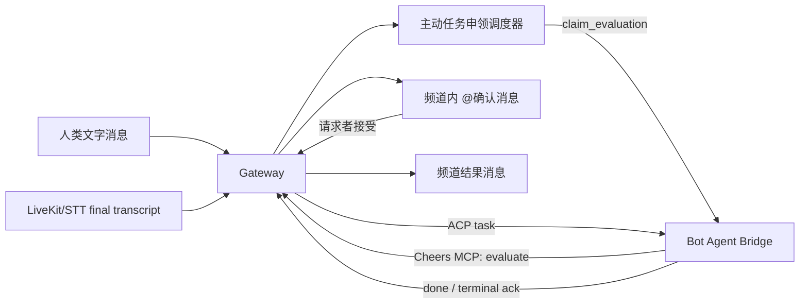

# Cheers 主动任务申领与实时语音协作

## 一句话总结

在多人文字或语音协作频道中，Bot 通过 Agent Bridge 接收系统调度的活动批次并判断“是否有适合自己执行的任务”。命中后，Bot 通过 Cheers MCP 创建一条 @ 请求者的频道内确认消息；用户接受后，Gateway 通过 ACP/Agent Bridge 下发任务，Bot 执行并把结果回写到频道。

## 核心架构



职责边界：

- Bot 自己通过 Agent Bridge 接收评估请求和任务；系统负责调度、节流、持久化和权限控制。
- ACP 负责会话、任务和结果传输，不承担频道级监听策略或人工审批状态机。
- Cheers MCP 的 `channel.task_claims.evaluate` 是申领决策写回 Gateway 的唯一入口；Gateway 仍负责校验、持久化、消息广播和任务派发。
- 语音频道沿用同一频道事件时钟，final transcript 与文字消息进入统一调度输入。

## 已实现能力

### 1. 频道级监听策略

每个 `channel + bot` 独立配置：

- `mode`: `off`、`text`、`text_and_transcript`、`all_activity`
- `scope`: 给 Bot 的任务范围说明
- `debounce_seconds`: 新活动稳定后等待时间
- `min_interval_seconds`: 两次评估之间的最小间隔
- `max_evaluations_per_hour`: 小时预算
- `batch_size`: 单次评估最多活动条数
- `confidence_threshold`: 低于阈值的申领不进入审批

调度器具备 durable cursor、批量合并、在线状态检查、小时预算、租约恢复和失败回滚。

### 2. 申领与确认状态机

```text
reserved -> dispatched -> completed
                      \-> failed

claim request:
pending -> accepted -> executing -> completed
        \-> rejected
        \-> failed
```

调度评估本身不产生普通聊天消息；命中后才在主消息流创建带 @ 的确认卡片。忽略、低置信度和失败结果均只写入 ViewBoard Activity。接受动作会广播 `task_claim_updated`，前端实时刷新确认卡片。

### 3. Agent Bridge / ACP 扩展

新增评估与结果事件：

- `claim_evaluation`
- `claim_evaluation_result`
- `task_claim_ack`

隔离评估阶段只暴露受限的 Cheers MCP 决策工具，不接受权限请求；只有请求者接受后才进入正式任务派发。

### 4. 实时语音频道

- LiveKit 负责实时语音媒体平面。
- STT Worker 写入 final transcript segment。
- transcript 使用频道 `channel_seq`，因此可以和文字活动统一排序、恢复和调度。
- 语音任务申领与文字任务申领共用审批、ACP 下发和结果回写链路。

## 本次验证结果

### 自动化测试

- Gateway Rust：185 个测试全部通过
- Rust Connector：117 个测试全部通过
- Frontend：90 个测试及生产构建通过
- `cargo fmt --check`、`cargo check` 通过
- Docker Compose 配置校验通过
- Gateway 无缓存镜像构建并健康启动

### E2E 场景

1. 文字消息触发评估，Bot 返回 claim，人工批准后收到 ACP task，Bot 回写完成结果。
2. 语音 final transcript 触发评估，人工拒绝后没有任务下发。
3. 重复批准返回 `409`，没有重复执行。
4. 内部 `is_secret` 触发消息不会被公开消息列表返回。
5. 新建频道时传入 `initial_bot_ids`，Bot 自动拥有 PRIMARY session。
6. 未认证请求返回 `401`。
7. 非法监听频率配置返回 `400`。
8. Gateway、Postgres、Redis、RustFS、Frontend 全部健康；Gateway 日志无 ERROR、panic、FATAL。

## 验证期间修复的问题

- 修复新建频道初始 Bot 未创建 PRIMARY session 的契约缺口。
- 修复审批先改状态、后检查 session 导致申领卡死为 `accepted` 的问题。
- 修复普通消息历史接口泄露 `is_secret` 内部触发消息的问题。
- 修复 `docker-compose.yml.template` 的 Gateway build context 与 Dockerfile 路径不匹配问题。

对应提交：`78a8a5b6 fix: harden proactive claim execution`

## 当前限制与下一步

本次 E2E 已覆盖 transcript 写入后的完整任务申领闭环；尚未在真实麦克风、LiveKit SFU、STT Worker 的媒体链路上做现场音频测试。上线前建议补充：

- 一台独立 LiveKit 主机上的真实浏览器麦克风通话测试
- STT Worker 断线、重连、重复 webhook 测试
- 多 Bot 竞争同一任务时的优先级或抢占策略测试
- 前端审批卡片在多人同时操作时的冲突提示测试
- 2G 服务器上的资源监控、连接数和并发语音压测

## 部署建议

当前阶段继续使用 Docker Compose 即可。LiveKit、Gateway、Postgres、Redis、RustFS、STT Worker 可以按资源拆分到不同主机；当需要多副本 Gateway、自动扩缩容、跨节点故障转移时，再迁移到 Kubernetes。

## 相关代码

- `server/src/gateway/task_claim_scheduler.rs`
- `server/src/api/task_claims.rs`
- `server/src/api/channels.rs`
- `server/src/domain/messages.rs`
- `server/migrations/0057_proactive_task_claims.sql`
- `packages/cheers-acp-connector-rs/`
- `frontend/`

## 2026-07-21 状态更新

自动认领任务已完成 C1–C4 的实现，当前分支新增以下提交：

- `612104e2`：申领生命周期治理、过期清理、立即触发与 quiet hours
- `9ee7816f`：语音转写保留、审计、导出/删除与语音配置
- `96293048`：MCP Tool、Resource verb 与 capability flag（Phase C4）

当前状态：功能已进入 PR 前收尾阶段。核心文字/语音申领闭环此前已完成 E2E 验证；由于上述最新改动尚未重新跑完整测试，提交 PR 前需要补跑 Gateway、Connector、Frontend 和相关迁移检查。

当前工作区存在 6 个未提交文件，属于其他进行中的变更，未纳入本次自动认领任务 PR：

- `.claude/launch.json`
- `.github/workflows/ci.yml`
- `.github/workflows/release-desktop.yml`
- `apps/macos/scripts/build-sidecar.sh`
- `apps/macos/src-tauri/tauri.conf.json`
- `packages/cheers-acp-connector-rs/src/bridge_runtime/prompt.rs`

PR 目标范围是当前分支相对远端的 3 个 claims/voice 提交及本总结文档。GitHub MCP 可以负责创建 Draft PR；本地 Git 仍需先推送分支。

### 最新检查记录

- Gateway `cargo check`：通过
- Gateway `cargo test`：185 通过
- Connector `cargo test`：118 通过
- Frontend `npm test`：90 通过
- Frontend `npm run build`：通过
- Frontend `npm run typecheck`：被现有 `PdfViewer.tsx` 的 `pdfjs` 类型错误阻断，与本次 claims 改动无关
- Gateway `cargo fmt --check`：被当前未提交文件中的格式差异阻断，未自动修改这些文件

## 2026-07-21 本地申领链路修复与复验

### 已验证闭环

`频道文字消息 → 调度器 → OpenCode/DeepSeek → Cheers MCP evaluate → @请求者确认消息 → 接受后任务执行` 已在本地真实 Bot 容器中跑通。

- Gateway Rust 测试：185 passed。
- Connector 测试：118 passed。
- Gateway 以无缓存镜像重建并健康启动；数据库迁移已应用。
- 最终评估状态为 `completed`，确认消息已持久化为 `task_claim_confirmation`，对应申领进入 `executing`。

### 本次根因与修复

1. **陈旧 ACP session**：Bot 容器重启后，持久化的 provider session 映射可能指向 OpenCode 中不存在的 session。Connector 现会在 `session/load` 失败时清除该映射并创建新 session；任务申领评估不会再向 Gateway 上报无效的普通会话更新。
2. **确认消息类型长度不足**：`messages.msg_type` 原为 `VARCHAR(16)`，无法写入 `task_claim_confirmation`。新增迁移 `0061_expand_message_type_for_task_claim_confirmation.sql`，将该列扩展至 `VARCHAR(64)`；不修改已应用迁移。
3. **中断评估无法重试**：租约恢复会回退 cursor，但唯一键阻止为同一活动范围插入新 evaluation。调度器现会重新激活已有 `failed` evaluation，复用其 ID 并保留 Activity 审计记录。
4. **可观测性**：ViewBoard Activity 会记录 `ignored`、`failed`、`completed`；空模型输出显示为 `bot session ended without a task-claim decision`，便于区分模型/会话故障与“不申领”。

### 后续：真实语音验证

文字申领已完成真实容器验证。下一阶段验证真实麦克风 → LiveKit 房间 → STT Worker final transcript → 相同调度器 → 确认卡片的媒体链路；这与此前仅注入 transcript 的 E2E 验证不同。

### 本地真实媒体配置（进行中）

- 浏览器媒体端点：`LIVEKIT_URL=ws://localhost:7880`。
- Gateway/Worker 内部端点：`LIVEKIT_INTERNAL_URL=ws://livekit:7880`。新增该配置是为了避免将 Docker 内部 DNS 名暴露给浏览器，同时保证 Gateway 的 agent dispatch 不会访问本机回环地址。
- 已为运行中的本地 LiveKit 容器补上 Docker 网络别名 `livekit`；Gateway → `http://livekit:7880` 连通性验证返回 HTTP 200。
- 仍待提供并配置：`VOICE_TRANSCRIBER_TOKEN` 和支持 OpenAI-compatible `/audio/transcriptions` 的 `VOICE_STT_API_KEY`。不可将仅支持聊天的 DeepSeek Bot key 当作 STT 凭据。
- 真实浏览器验证还需要在本机 Cheers 页面以频道成员登录并接受麦克风权限；再由频道 owner/admin 启动转写。

### StepFun ASR 接入（2026-07-22）

- 已新增 `VOICE_STT_PROVIDER=stepfun` adapter，使用 `https://api.stepfun.com/v1/audio/asr/sse`。
- Worker 继续使用本地 Silero VAD 生成语句边界；每个 PCM 片段以 Base64 JSON 提交给 StepFun，消费 SSE `transcript.text.done` 后写入 durable transcript。
- 配置：`VOICE_STT_PROVIDER=stepfun`、`VOICE_STT_MODEL=stepaudio-2.5-asr`、`VOICE_STT_LANGUAGE=zh` 以及仅存于 `.env` 的 `VOICE_STT_API_KEY`。
- Worker 镜像构建、StepFun adapter 导入和构造、Compose 配置校验均已通过。
- 已用 1 秒静音 PCM 完成真实 StepFun HTTP/SSE 验证（HTTP 200，收到 `transcript.text.done`），并通过 Worker adapter 的同一路径 round-trip 验证。
- `cheers-transcriber` 已注册到本地 LiveKit；待浏览器完成频道登录、加入房间并授权麦克风后进行真人语音 → transcript → 自动申领验证。

### 语音加入 500 修复（2026-07-22）

- 真实 join 请求发现 `voice_participant_sessions.consent_version` 为 `NULL` 时，Gateway 将它按非空 `String` 解码，造成 `/voice/join` 返回 HTTP 500。
- join 路径现显式处理“无 participant row”及“participant row 存在但 consent 为 NULL”两种状态；后者表示尚未接受转写披露，属于正常 listen-only 流程而非服务器错误。
- Gateway 语音测试（6 passed）、`cargo check` 与无缓存 Docker 镜像重建均已完成。
